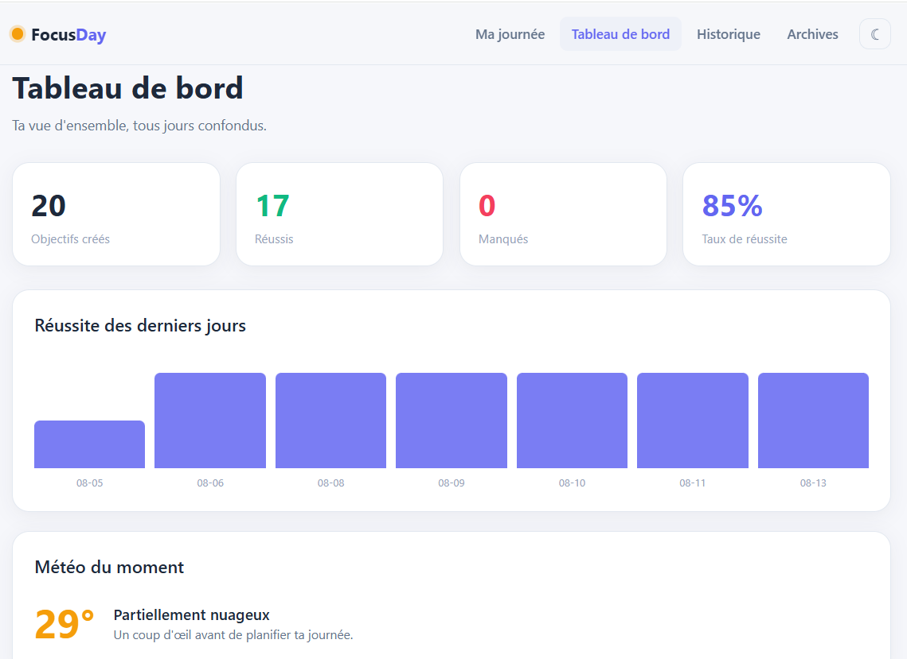
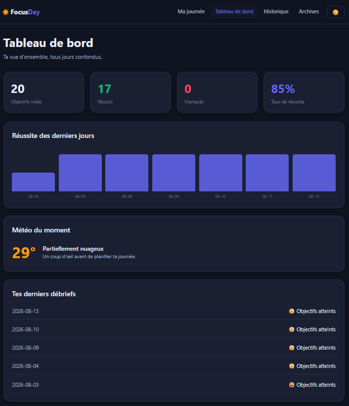
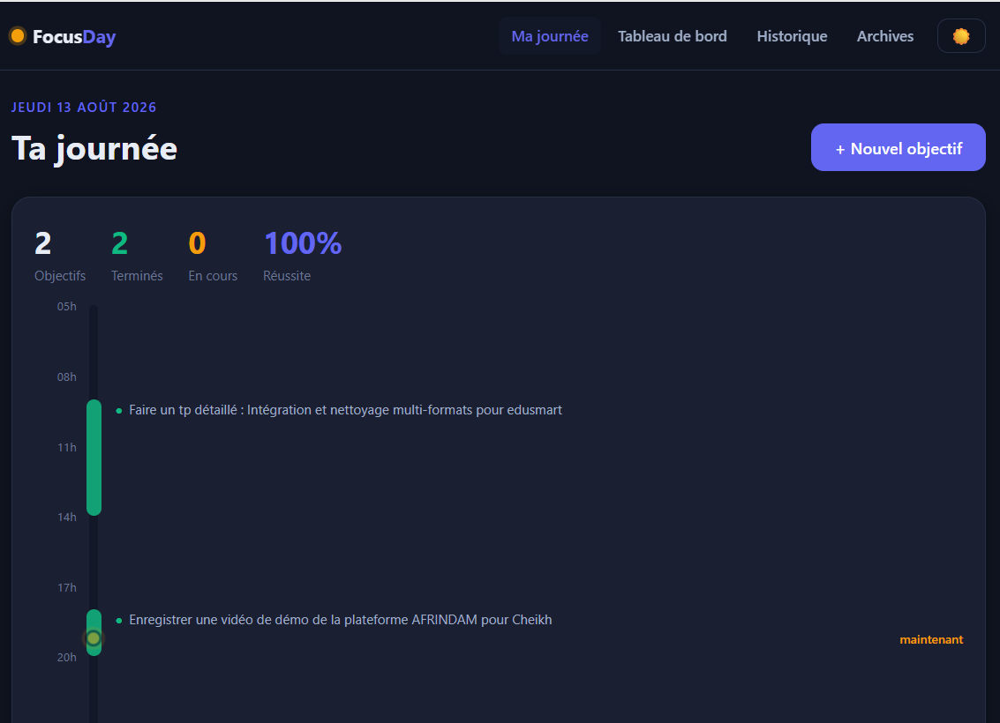
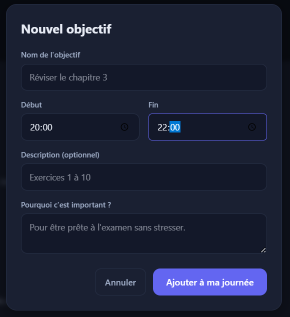
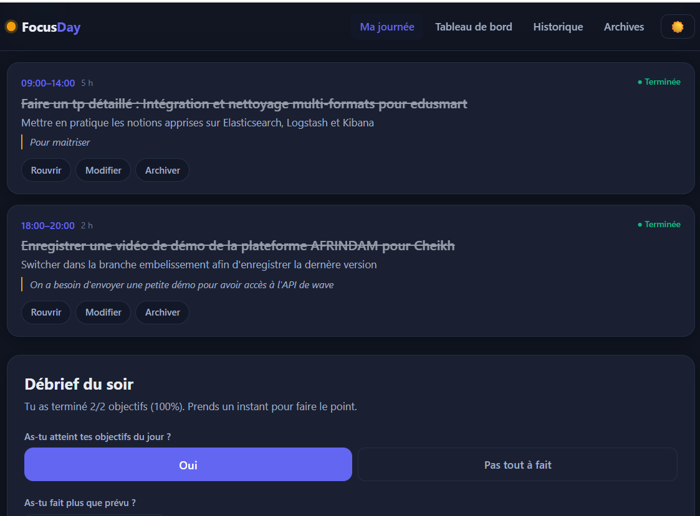
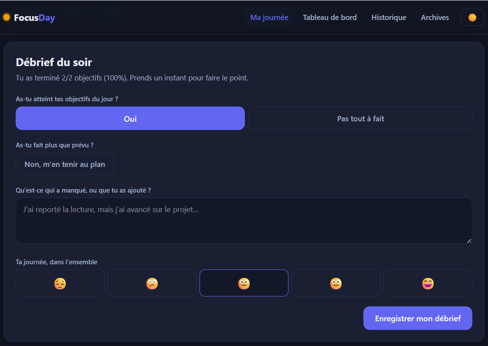
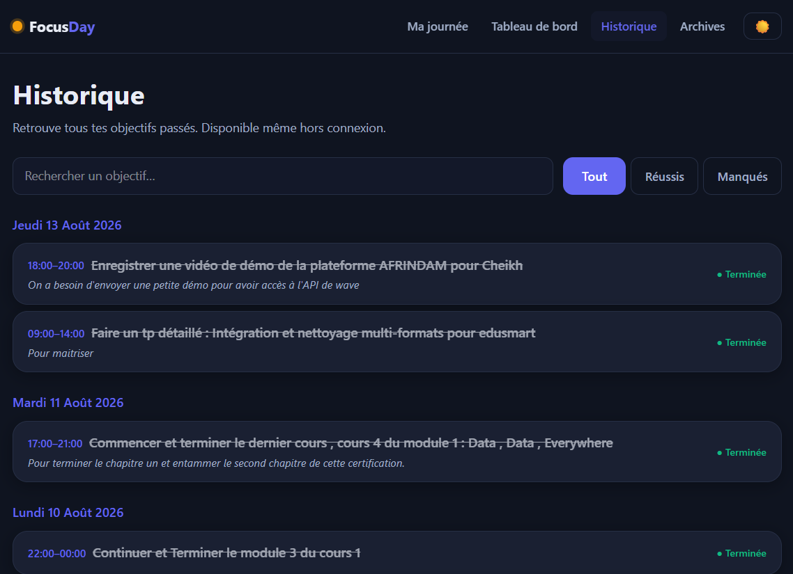

# FocusDay ⏳

**Un coach de productivité temporel — pas une todo-list.**

FocusDay t'aide à piloter ta journée par créneaux horaires : tu planifies tes
objectifs (de quelle heure à quelle heure), tu dis *pourquoi* c'est important,
et l'app te relance quand l'heure approche. Le soir, tu débriefes.

> **🔗 Démo en ligne : [focus-day-nps.vercel.app](https://focus-day-nps.vercel.app/)**

## Aperçu

Le tableau de bord, en **thème clair** et **thème sombre** :

| Thème clair | Thème sombre |
| :---: | :---: |
|  |  |

**Ta journée** — la timeline avec le curseur « maintenant » qui glisse, et le taux de réussite qui se met à jour en direct :



**Créer un objectif** — un nom, un créneau horaire, une description, et surtout le « pourquoi » qui te motive :



**Les objectifs en cartes** — statut riche (à faire / en cours / terminé / manqué) et actions rapides sur chaque objectif :



**Le débrief du soir** — le moment réflexif qui distingue FocusDay d'une simple liste : as-tu atteint tes objectifs ? fait plus que prévu ? quelle humeur ?



**L'historique** — recherche et filtres (tout / réussis / manqués). Tes données restent dans ton navigateur (`localStorage`), donc l'historique reste consultable même sans connexion :



## Ce qui le rend différent

- **Créneaux horaires** — chaque objectif a une plage (08:00–10:00), pas juste une date.
- **Le "pourquoi"** — la motivation de chaque objectif, affichée pour te la rappeler.
- **Rappels intelligents** — quand un créneau approche et que tu n'as rien marqué,
  une notification te dit combien de temps il reste.
- **Statuts riches** — à faire / en cours / terminé / manqué (au lieu d'une case cochée).
- **Timeline de journée** — un ruban de temps avec un curseur « maintenant » qui glisse.
- **Débrief du soir** — as-tu atteint tes objectifs ? fait plus ? qu'a-t-il manqué ?
- **Tableau de bord** — taux de réussite, courbe des derniers jours, météo du moment.
- **Historique** avec recherche. Les données vivant dans `localStorage`, il reste consultable hors connexion (l'app n'est pas encore une PWA à service worker).
- **Thème clair / sombre**.

## Stack

- **Next.js 16** (App Router) + **TypeScript** + **Tailwind v4**
- Stockage : **localStorage** derrière une couche d'abstraction (`lib/store.ts`) —
  prête à migrer vers une vraie base (Supabase/Firebase) en ne changeant qu'un fichier.
- Notifications : **Notification API** (niveau navigateur), architecture prête pour
  du push serveur plus tard.
- Météo : **Open-Meteo** (gratuit, sans clé) + géolocalisation.

## Lancer en local

```bash
npm install
npm run dev        # http://localhost:3000
```

Autres commandes :

```bash
npm test           # tests unitaires (Vitest)
npm run lint       # ESLint (config plate Next 16)
npx tsc --noEmit   # vérification des types
npm run build      # build de production
```

## Qualité & tests

- **TypeScript strict** de bout en bout, aucune erreur de type.
- **Tests unitaires (Vitest)** sur la couche métier temporelle (`lib/time.ts`) :
  conversion des heures, créneaux qui traversent minuit, détection de
  chevauchements, calcul des statistiques, bascule automatique en « manqué ».
- **Intégration continue** (GitHub Actions) : lint + types + tests + build
  à chaque push et pull request (`.github/workflows/ci.yml`).
- **Accessibilité** : navigation clavier (Échap/Entrée sur les dialogues),
  attributs ARIA, focus visible, respect de `prefers-reduced-motion`.

## Déploiement

Le plus simple est **Vercel** (éditeur de Next.js) :

1. Pousse le dépôt sur GitHub.
2. Sur [vercel.com](https://vercel.com), « New Project » → importe le dépôt.
3. Aucune variable d'environnement requise (tout est en `localStorage`).
4. Déploie — l'app est en ligne ici : [focus-day-nps.vercel.app](https://focus-day-nps.vercel.app/).

## Origine

Le concept prolonge un sujet d'examen de M1 réalisé en **2025** (todo-list
Flutter + API PHP/MySQL). Je l'ai repris et largement personnalisé en **2026**
pour aller bien au-delà : là où le sujet demandait de *stocker* des tâches,
FocusDay cherche à *accompagner* une journée — avec les créneaux, le pourquoi,
les rappels et le débrief réflexif.

---
Conçu par **Ndeye Penda Sarr** — 2025–2026.