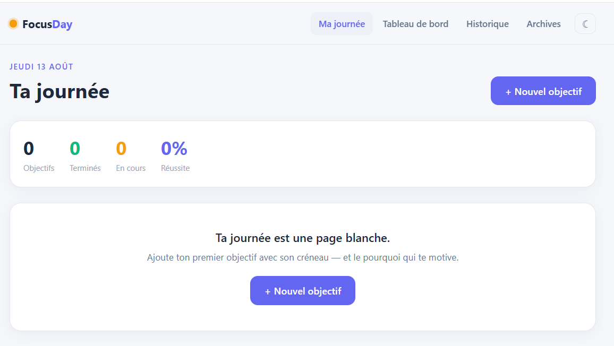
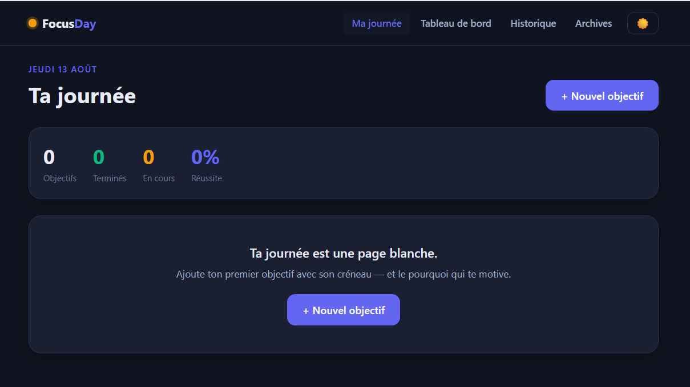
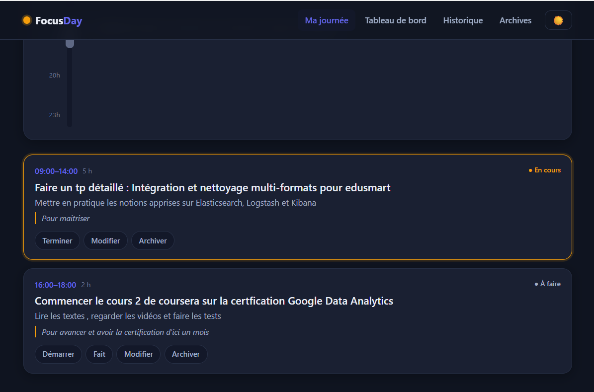

# FocusDay ⏳

**Un coach de productivité temporel — pas une todo-list.**

FocusDay t'aide à piloter ta journée par créneaux horaires : tu planifies tes
objectifs (de quelle heure à quelle heure), tu dis *pourquoi* c'est important,
et l'app te relance quand l'heure approche. Le soir, tu débriefes.

## Aperçu

| Ma journée — thème clair | Ma journée — thème sombre |
| :---: | :---: |
|  |  |

**La timeline du jour**, avec le curseur « maintenant » qui glisse et chaque objectif placé sur son créneau :


**Les objectifs en cartes** — statut riche (à faire / en cours / terminé), description et le « pourquoi » qui motive :



**Le tableau de bord** — taux de réussite, courbe des derniers jours, météo du moment et journal des débriefs :


**L'historique** — recherche, filtres (tout / réussis / manqués), disponible même hors connexion :


## Ce qui le rend différent

- **Créneaux horaires** — chaque objectif a une plage (08:00–10:00), pas juste une date.
- **Le "pourquoi"** — la motivation de chaque objectif, affichée pour te la rappeler.
- **Rappels intelligents** — quand un créneau approche et que tu n'as rien marqué,
  une notification te dit combien de temps il reste.
- **Statuts riches** — à faire / en cours / terminé / manqué (au lieu d'une case cochée).
- **Timeline de journée** — un ruban de temps avec un curseur « maintenant » qui glisse.
- **Débrief du soir** — as-tu atteint tes objectifs ? fait plus ? qu'a-t-il manqué ?
- **Tableau de bord** — taux de réussite, courbe des derniers jours, météo du moment.
- **Historique** avec recherche, disponible hors connexion.
- **Thème clair / sombre**.

## Stack

- **Next.js 16** (App Router) + **TypeScript** + **Tailwind v4**
- Stockage : **localStorage** derrière une couche d'abstraction (`lib/store.ts`) —
  prête à migrer vers une vraie base (Supabase/Firebase) en ne changeant qu'un fichier.
- Notifications : **Notification API** (niveau navigateur), architecture prête pour
  du push serveur plus tard.
- Météo : **Open-Meteo** (gratuit, sans clé) + géolocalisation.

## Lancer en local

```bash
npm install
npm run dev
```

## Origine

Le concept prolonge un sujet d'exame de M1 (todo-list Flutter + API PHP/MySQL) en
allant bien au-delà : là où le sujet demandait de *stocker* des tâches, FocusDay
cherche à *accompagner* une journée — avec les créneaux, le pourquoi, les rappels
et le débrief réflexif.

---
Conçu par NPS.
